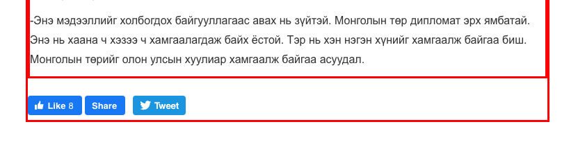

Uuganbold Tsegmed 
Comp 479 – Machine Learning 
11 November 2019 

# New Extractor

In this project, I built a model that could extract the title and the main textual content from 
news web pages. According to the test result, my model can correctly identify the title **90%**, and 
the content **75%**. 

When we crawl websites to build a search engine or for other purposes, 
it turns out very difficult because of noisy contents not related to the main article. 
It will be useful for us on that occasions.

## Approach
When we visit websites, we can distinguish easily title and content of the main article. My goal is to make the machine have that sense.

In my opinion, we may make a conclusion based on the visual perception. For example: the position on the display, size of the text, color and weight of the text etc.

On top of that, I think developers adopt similar practices to build their web pages. There may be some similarity including similar html tags to create similar components, html elements' hierarchical structures etc.

Therefore, my model was trained to understand that sense and similarity.

And also one thing to notice is that I trained two models because I am looking for **title** and **contents** which should be extracted by different way.

## Application

I developed a nodejs application with which I can create my dataset for training and extract the title and the content
from web pages using the model I trained in this project.

The application is located in the [webscraper](https://github.com/uuganbold/news_extractor/tree/master/webscraper) directory of the source [code](https://github.com/uuganbold/news_extractor).

## Dataset

The dataset was scraped from 120 different websites, one page from each website. 
It has 119807 rows, each of which represents each HTML element of the web pages. 
That means average page contains 1000 HTML elements. 

The dataset is pretty imbalanced because each web page contains only one title and one content while
it contains a thousand html elements.

#### Attributes
**site**: the website's name from which the element is extracted 
**url**: the web url from which the element is extracted 
**tagName**:the element's html tag 
**left**: X coordinate of the top-left point of the element on the page 
**top**:Y coordinate of the top-left point of the element on the page 
**width**:the element's width on the page 
**height**:the element's height on the page 
**children**:count of direct child elements 
**textCount**:length of the text in the element 
**parentCount**:count of the ancestor elements 
**fontSize**:font size of the text 
**linkCount**:count of the &#60;a&#62; elements in the element 
**paragraphCount**:count of the &#60;p&#62; elements in the element 
**imageCount**:count of the &#60;img&#62; elements in the element 
**colorRed**:the red attribute of RGB color of the texts in the element 
**colorGreen**:the green attribute of RGB color of the texts in the element 
**colorBlue**:the blue attribute of RGB color of the texts in the element 
**backgroundRed**:the red attribute of RGB color of the background of the element 
**backgroundGreen**:the green attribute of RGB color of the background of the element 
**backgroundBlue**:the blue attribute of RGB color of the background of the element 
**backgroundAlpha**:the transparency attribute of the background of the element 
**textAlign**:text alignment of the text in the element 
**marginTop**:top margin of the element 
**marginRight**:right margin of the element 
**marginBottom**:bottom margin of the element 
**marginLeft**:left margin of the element 
**paddingTop**:top padding of the element 
**paddingRight**:right padding of the element 
**paddingBottom**:bottom padding of the element 
**paddingLeft**:left padding of the element 
**descendants**:count of descendant elements 
**relPosX**: Relative position to the page 
**relPosY**: Relative position to the page 
**title**: whether the element is title of the article  
**content**:whether the element is main content of the article 

## Training

The model was trained with the data scraped from 100 websites out of the 120 websites, the twenty was left for the test. 
And I duplicated the dataset for title and content. 

**Briefly, I accomplished steps below on data preprocessing phase.**
1. Removed useless column - url
2. Changed non numeric values with the most frequent values - margins, paddings
3. Some html tags are not available to make title or content with it. 
So I removed those rows from training set and if those elements are encountered on
testing or application level, they would be tagged negative. 
3. Onehot-encoding for nominal features - tagName, textAlign 
Onehot-encoding feature for the most frequent value was removed because it would decrease
my dimension and it allowed me to convert a totally new value to the most frequent one
if it is encountered on testing or application level.   

**I used k-fold validation and grid search to find the best model.**

**F1 score was the most proper measurement because:**
* Accuracy would never show reliable number because of the dataset's unbalance.
* Precision should be considered because I did not want "noise"
* Recall should be considered because I did not want to miss my "precious information"
* Considering both precision and recall means F1.

### Training results
1. On my first experiment, I got almost 100% accuracy, but 0% precision and 0% recall. 
Then, I realized it was due to the dataset's unbalance. 

2. On my second experiment, I used oversampling to improve the balance and got the result below with SVM

|     Metrics | Title |  Content |
| ------- | -----: | -------: |
| Accuracy | 0.994 | 0.988 |
| Precision | 0.109 | 0.07 |
| Recall | 0.7 | 1.0 |
| F1 | 0.189 | 0.132 |

It meant that my model could find what I was looking for very well (0.7, 1.0), but 
also found what I did not want (0.109, 0.07). 
My model gave me many positive results even though I was looking for only one positive result. 

3. So I made my model to give me only one positive result based on the probability using a wrapper function.
I got the result below with LogisticRegression.

|     Metrics |  Title | Content |
| ------- | -----: | -------: |
| Accuracy | 0.999 | 0.998 |
| Precision | 0.720 | 0.610 |
| Recall | 0.720 | 0.625 |
| F1 | 0.720 | 0.617 |

4. Then, I read that Decision Trees algorithm performs well on imbalanced dataset. So, I trained the RandomForest
on my dataset and got the result below

|     Metrics |  Title | Content |
| ------- | -----: | -------: |
| Accuracy | 1.0 | 0.999 |
| Precision | 0.94 | 0.83 |
| Recall | 0.94 | 0.85 |
| F1 | 0.94 | 0.839 |

According to the result, the model trained with RandomForest algorithm was the best model. 
Therefore, I chose that as my final model used for my application.

## Testing
On test set, the model showed the result below.

|     Metrics |  Title | Content |
| ------- | -----: | -------: |
| Accuracy | 1.000 | 0.999 |
| Precision | 0.900 | 0.750 |
| Recall | 0.900 | 0.750 |
| F1 | 0.900 | 0.750 |

The numbers decreased slightly than validation numbers, but since in my test set only 20 positive 
samples, the each failed prediction would decrease the numbers by 0.05. It meant that the difference 
between validation and testing was only 1 miss.

Therefore, I think the model was generalized well and it proved by testing.

## Further development
I have come to some ideas that could improve my model and evaluation. Unfortunately, because there is no time
left to implement those ideas, I will save them for another time.

1. I made some experiment to add same data as those was tagged wrongly. But I stopped to work on it
because it seemed not to show much improvement. Nonetheless, I think logically it would work, 
so I will consider it seriously later. 

2. I noticed that some prediction was deemed as missed even though it can be considered right.

For example, on the image above, the model distinguished the outer element which added only few buttons.
  Technically, it could be tagged positive because it did not add any text to the content. Even there was 
some cases that the outer element did not add anything to the inner element and just wrapped it.
  So, I will prepare the dataset differently and make my model can accept multiple positive element as training data and output only one positive result.
And also, it will be evaluated on whether it can distinguish one of those positive samples.    

## Conclusion
The identifying only one from the thousand was not easy as it sounds. Even though it seems not good and far below from my first expectation, I think the F1 score 0.9 and 0.75
is great start to improve but the lesson was learned. 

While working on the project, I comprehended about difficulties of imbalanced dataset and adopted some technique 
to tackle the difficulties. On top of that, I got good sense about insight of the metrics to evaluate models. 

In addition, it was good a lesson to learn using a ML model in my application. I persisted my model to file and used in my application.

